`本文零散完稿于2026年一月`

> 去年夏天回国休假三个月有余，期间和妈妈一起自驾回了河北老家。一路上有欢声笑语的时光，也有能让我潸然泪下的情绪起伏。如果把我的记忆比作一张雪白的画布，这些时刻就好像洒在上面的浓墨重彩，有些明艳，另一些却也灰暗，现在回味起来仍是五味杂陈。近日偶然得空，便想用我的文字将这写感受都记录下来，这样即使以后哪天得了老年痴呆，我仍可以通过这些文字回到过去感受那个夏天微微潮湿的空气。

## 徐州，梅雨
从南京到河北省定州市大约有 900 公里的车程，开得快的话一天能到。这也不是我们头一次自驾回老家了。以前是父母交替着开，现在这份担子也匀了一边到我的肩头。路线大概是从南京到徐州，然后再从徐州到定州。由于爸爸正巧要去徐州出差，我们便先是全家三人先一起出发，然后到达徐州之后我和妈妈再轮流开到河北。

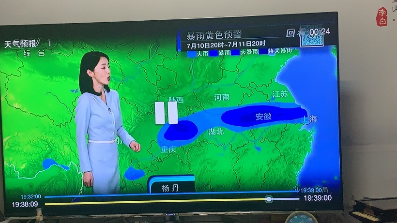

七月中旬正值梅雨季节的尾巴，副高北侧的梅雨带正从长江流域北跳到淮河流域。临行时我们查看了天气预报，我们到达徐州的时候将会不巧地赶上刚刚从南京离开的主雨带中心。到达徐州市之后我们先车头一拐去龟山汉墓看了一圈，这时的雨势已经渐渐猛烈。待我们匆匆撤出景点再上徐州绕城高架上前往下榻的旅馆时，正好是我在驾驶，雨势也在此时达到了极盛。很快我们前方就发生了严重的塞车。一开始我们还以为堵车是由于前方车辆在暴雨天缓慢行驶导致的，走了一段距离后才发现天都塌了：前方的高架即将转入隧道通过一个铁路桥，而桥下的隧道里已经满是积水了！没想到以前在报纸上看到的涵洞积水剧情竟然真实地发生在了我们自己身上。但此时我们已别无选择，由于高架桥是封闭的没有出口，我们也只能被车流裹挟着继续前行。

行驶到桥下后我们松了一口气，原来只有大约一半的路面被黄色的积水淹没，有一个车道尚可勉强通行，大伙儿们正在排队通过这个车道。我们跟着通过这一涵洞之后，很快发现涵洞中的积水从何而来：出涵洞之后又是一段高架，这段高架依山而建，浑黄的山洪遇到紧贴着的路面无处可去，只能沿着最外侧车道滚滚而下，然后流入涵洞。我们由于走在比较靠右的车道，将会穿过被山洪覆盖的路面。这是我第一次遇到城市内涝，当时真的非常害怕积水直接给发动机整熄火了，心情紧张到了极点。驶过积水路段时，我能听见水花打在车门上的声音，也感觉车子的前进收到了流水横向的作用力，方向盘似乎也没之前好把握了。但好在我们最后还是有惊无险地通过了这一内涝路段。后面快到目的地的时候又在一个需要右转的地方遇到了积水，我们迫不得已放弃右转直行掉头之后再左转。

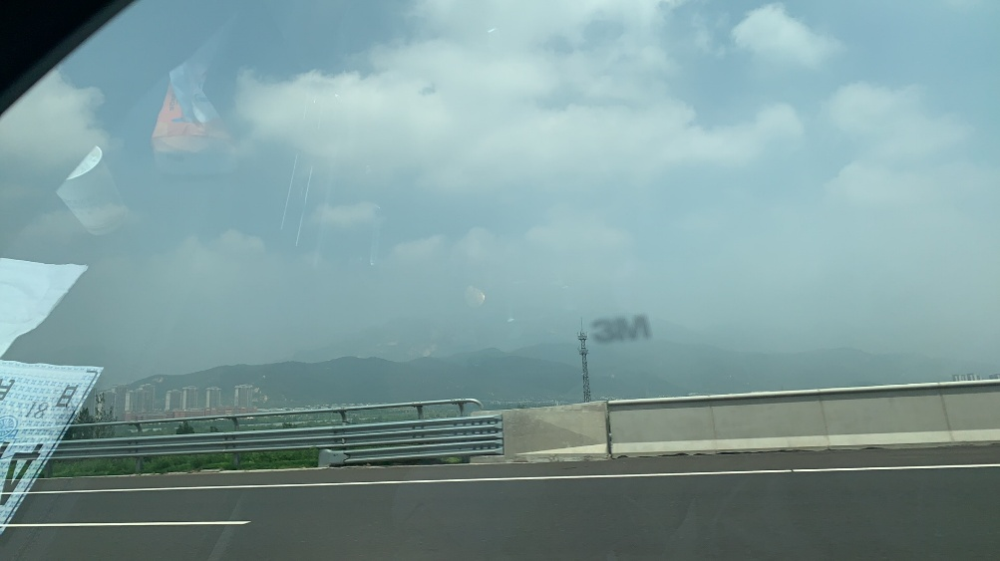

第二天早晨雨过天晴，我和妈妈早早上路。这次回老家主要是想看看姥姥。到达定州之后，我已经几乎不认识这里了。主干道两侧竟然出现了之前无法想象的 CBD，影城和各种餐厅的招牌已是让人应接不暇，颇有点南京德基广场的味道。我小的时候路边还都是卖小吃糖葫芦的简陋三轮车呢。如果我是生活在定州的小孩，我的童年应该也会很快乐吧？我这样想着。

## 到达定州

我们到达家里的时候，姥姥正笑眯眯地坐在沙发上看电视。她头顶的银发似乎比以前更稀疏了些，身体也许是由于糖尿病的缘故，消瘦了不少。我坐到姥姥身旁时有些紧张地想，我在加拿大的时候姥姥犯过一次轻微的脑梗住了几天院，不知道现在她的各项认知功能如何啊。她开口后我便松了一口气------还好，还认识我。只是和三年前相比，她的语速更慢，声音也有些颤抖。耳朵也更不好使了，我和她对话的时候需要大声喊出来。不知为什么，姥姥对于我们给她佩戴助听器的提议一直坚决反对。想到姥姥没有助听器的生活，我不由得一阵心痛。由于腿脚已很不灵便，她现在基本不出门，和外界的接触少之又少。在这种情况下，眼睛看不清，耳朵也听不清，连电视，报纸的内容大概也很难理解吧。我不由得想，这样的封闭而死板的生活有什么乐趣呢？每日是重复的三餐，休息……说是被监禁了也不为过吧？我老了之后，也许也会过上这样的生活吗？我不敢再想。

我们先是在定州休整了 2 天左右。大舅带着我去转了转新开的历史博物馆，又去再爬了一次定州的开元寺塔。这里打一波广告，开元寺塔是中国现存最高的砖塔！我上次爬应该是很小的时候了，已完全失去印象。大舅由于之前也脑溢血过，腿脚不便，干脆在塔下等我，让我独自登塔。塔的阶梯一级高足足半米左右，向上攀爬需要抓住狭窄甬道两旁的铁索借力。到达最高层后，我开始探索塔内的空间。墙壁上有许多用玻璃罩保护起来的古人墨迹。有的是文人墨客的题诗，还有的只是类似现在 "xxxx 到此一游" 的一小行文字，只不过 文绉绉的。我的脑海中不由得开始脑补古代穿着 粗布衫 布鞋 的书生手脚并用气喘吁吁地登塔的场景，读书人 那种 气定神闲 怕不是在这狼狈中丢的一干二净了吧！（虽说如此，王安石登塔还是写下来登飞来峰这种诗么确实有些性格。）哈哈，不过其实读书人也是普通人嘛，也会像普通人一样题"到此一游"。我不禁想到，也许当代游客的所谓"不文明行为"，那些歪歪扭扭的"到此一游"和"xxx love xxx"，在未来的社会也成为用玻璃罩保护起来的文物？那样的场景可真是太滑稽了。这样看来，文不文明的说法根本就不存在嘛。

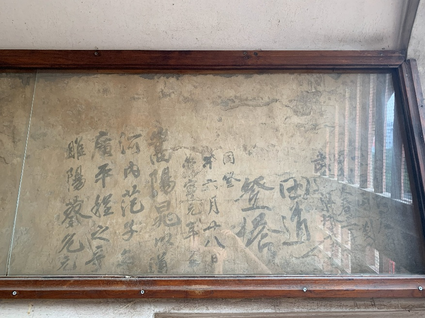

## 张北之行
休整期间，妈妈向我透露了她想开车带上姥姥，大舅和小舅去张北 (张家口北边的一个县) 附近的网红景点 "草原天路" 的旅游计划，并征询我的意见 。我有些担忧地表示姥姥的健康状况是否能够承担旅途的颠簸。妈妈也是直言道，也许再不去，就没机会去了。她接着解释道，也正是因为高风险，这个计划她谁也没告诉，特别是爸爸，因为他一定会反对。也许 这就是姥姥这辈子最后一次出游了, 我在心中想着。妈妈是他们兄弟姊妹中离老家最远的孩子，此刻想抓住宝贵的机会尽尽孝，我又怎能拒绝？于是我立刻答应下来，和妈妈轮流开车去张家口。令人意想不到的是，当妈妈向大家坦白旅游计划的时候，姥姥竟然表示强烈地反对。我们劝说了一会儿还是无果。妈妈私下对我说，姥姥应该是有些怕死在外面。这时我才意识到，虽然姥姥性子刚烈，不是那种封建愚昧的旧社会女性，却也难免收到几千年以来的朴素的农村文化影响吧。令人欣喜的是，过了一会儿之后姥姥答应了下来。

### 太行山区
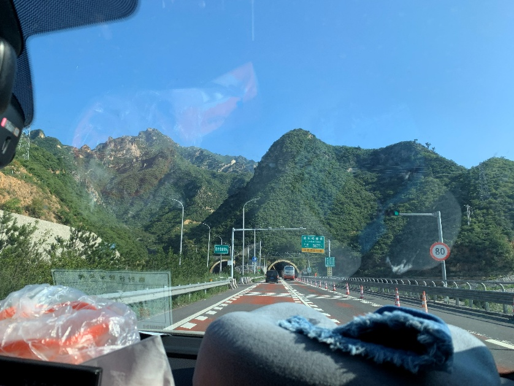

第二天清晨 6 时左右我们一行人便趁着暑热未起出发。 全程是我和妈妈轮流开车，我们坐在前排，姥姥，小舅和大舅则坐在后排。出发前还以为我们会需要从京石高速公路到达北京后再去张家口, 结果导航规划的路线显示是从西边走。我们将先向西经过曲阳，然后再向北从涞源，蔚县穿过太行山，最后沿着桑干河附近的谷地北上到达张家口。当然这个路线是我事后看地图总结的，当时我还没有意识到我们会穿过太行山区。行程伊始，姥姥人还挺精神的，还能认出我们是走到哪里了。行至曲阳，高速两旁开始出现几十米高的小山丘。大舅这时评论道，马上进涞源之后就净是山了。很快，我意识到我们进入了山区。这里的路大家便都不熟悉了。这里的长隧道一个接着一个，限速也降到了 80-90 km/h。我不禁联想到很小的时候我们自驾从南京前往西安在秦岭的山区中也是如此，出了十几公里长的隧道之后还没窥见天空转头便扎进下一个十几公里的隧道，简直暗无天日。

就在我渐渐适应了隧道中昏暗的灯光时，高速公路却突然从群山之中冲出，进入了一片宽阔的谷地，隧道瞬间变成了高达百米的高架桥！惊愕之中，当我的目光瞟向右侧时，看见了更为壮观的景色 --- 在平整的谷地边缘毫无预兆地升起了一片山群！它们耸然屹立，陡峭的崖壁几乎与地面呈直角，仿佛从大地の牙床上生出的一排尖锐的利齿，挺拔而威严，让人心生敬畏。此刻如果从远处眺望，我们所处的百米高架应该只是一根细到可以忽略的牙线，正在牙根附近缠绕着。如此莽然浩荡之气，难道这就是太行山么？我心潮澎湃地想着。那这应该是我第一次仰望太行啊。在那一瞬，我突然想到了李白的 "将登太行雪满山"这一句。在太行山下，纵使诗仙也很难不"拔剑四顾心茫然"吧。

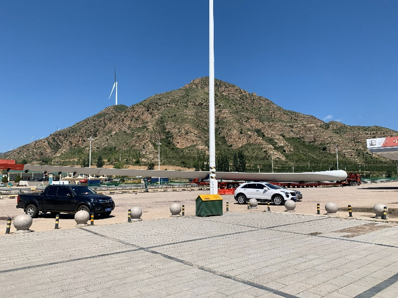

可惜当时的我正在驾驶，所以必须将视线赶快移回正前方。毕竟在高达百米的高架上行驶给我带来的紧张感一点也不比太行山的冲击力来的弱。虽然我没有恐高症，但不知怎么地，我觉得车身轻飘飘的（现在想来可能有横风！），因此格外需要集中注意力。虽然算力吃紧，我的大脑还是捕捉到了一丝诡异 --- 如果是从东南向西北自华北平原上太行山，山体应该出现在道路的左侧才对，为何此刻群山却在右侧？我事后查阅地图得知，此刻我们其实已经通过之前的一系列隧道穿过了太行山，正处于与山脉北麓相接的桑干河大峡谷中。地图中显示太行山脉在这里正好是东北-西南的走向。这，就说得通了。而我们所处的桑干河盆地，西连大同，向东可以到达张家口-宣化盆地，从那里往南就是八达岭和居庸关了。又开了一阵，路标果然显示这里是桑干河大峡谷，而且马上就要途径蔚县。

### 历史回响

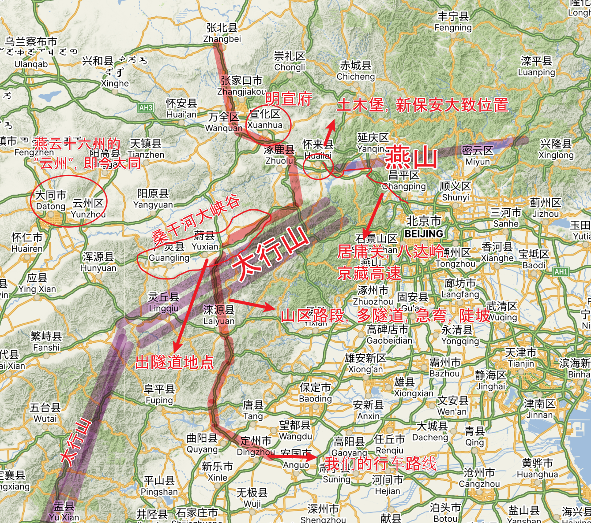

说到这里，熟悉明朝历史的朋友可能 DNA 要动了，这些地名怎么这么熟悉呀，这不是土木之变发生的地方吗？不错，这个蔚县呢，就是明朝正统年间权倾朝野的大太监王振的老家。正是他，仅仅因不想破坏这里的麦田而命明军从大同向东北绕路经宣府入居庸关，最终导致野战战败，明英宗被俘。后来我又对比地图得知，宣府其实就是如今的张家口宣化区，也在我们此次的必经之路上。这样看来，我们这次出行，实际上是重走了当时明军的一部分行军路线啊。想到这里，当时深夜中趴在定州老家的床上看电子地图的我感觉心中有些莫名的悸动。似乎在这静谧的夜幕下，古今的时空正悄然重合。

很快我又有了新发现。在张家口和八达岭之间的盆地中，有一个怀来县，里面有一个"土木镇"，想必这里就是英宗快乐镇了。光这一个还没完，目光移向怀来县的西北，还有一个 "新保安镇"，这不就是平津战役的时候傅作义的 35 军被包围歼灭的地点么......  哈哈。虽然有点地狱，但是我还是忍不住笑出了声。看来这个链接北京和张家口的盆地，古往今来都是战略要地呀。

我的目光继续移向地图上的居庸关和八达岭。京藏高速公路孤零零地从居庸关和八达岭之间的窄窄的山谷从北京市区穿出。这个古代政权重兵把守的都城门户，现在已经天堑变通途了么，还真是感慨啊。 看到这里我又想起，小时候和妈妈第一次去北京玩的时候，旅行社本来声称要去八达岭长城，最后变成只给我们 40 分钟游览居庸关长城。更令人心碎的是，我们母子只是迟到了几分钟，大巴就抛下我们走了。后来我们气愤之余遇到了一个出租车司机，给了他 300 块钱，让他带我们去了线路本不包含的八达岭长城，明十三陵等地。后面可能要购物的时候，旅行社终于想到了我们，还给我们打电话让我们回去，我们自然是拒绝，拜拜了您嘞。

书归正传，我们沿着盆地向张家口和张北驶去，在最后一段路突然发生了堵车，大概被堵了一个小时。当时也是我在驾驶，停停走走间我就有些头昏脑涨。这时一路酣睡的姥姥不巧地醒来了，开始颤巍巍地问着"这是哪儿哎？我要回去！"那声音中充满了无助与不安，任凭我们如何解释，她还是在反复地询问和要求和吵闹。这种负面的情绪很快影响到了我，我的头痛愈发的严重，这是以前从来没有出现过的现象。作为司机，堵车本来就心烦，又遇见姥姥的种种情况，我便更加烦躁。下高速后我们找了一家当地的餐馆。在停车的时候，不记得发生了什么事情（也许是因为头更疼了？）我的忍耐力终于到达了极限，我很想找个宣泄的口子，但却又找不到发泄的对象。妈妈一直在一个人安排着我们出行的行程，劳苦功高啊。姥姥已经糊涂了，那还能怎么办呢。没有一个人有错，但是氛围就是这么令我感到窒息。我当时还是想通了，得 配合妈妈。于是我一怒之下又继续忍着。真的很难受了。吃饭的时候，姥姥也是闹着不吃饭，弄得我们都很尴尬。我继续忍。饭后我们驱车驶向提前订好的民宿。公路不好开，经常拐弯还是双向单车道，视野有时还会被道路两旁的树木遮挡。导致转弯时我必修谨慎又谨慎，非常消耗精力。我头痛欲裂，已经快要受不了了。还好，离开城市之后我们渐渐地驶入了广阔的草原，周边的景色令人心旷神怡。虽然如此，我的头痛还是非常严重。一到民宿我在沙发上倒头就睡，在昏迷之前迷迷糊糊地听见大舅说"让他睡会儿吧......"

一个多小时之后，我醒来了，感觉头痛已经消除了大半。我得知姥姥也已经疲惫得沉沉睡去。大舅提议他在民宿看着姥姥，让我，妈妈和小舅先去附近的野狐岭玩。野狐岭是茫茫草原上的一个山丘。在半山腰的历史博物馆里，我了解到，成吉思汗进入中原之前的决定性战役 野狐岭战役 就发生在这里。令人难以置信啊，现在游人如织的公园（其实也没那么多），就是几百年前金国的野战主力被歼灭的地方。登临野狐岭的主峰远眺时，方圆十几公里内起伏的草原尽收眼底。几条公路穿插行其间，像芝麻一般的汽车若隐若现地行驶在似乎永远都开不到头的草场上。我想象着古代的将领在这里远眺大军进行会战的场景，却实在构思不出。部分的原因也许是草原上那些令人出戏的一座座高大的白色风车吧。目光所及之处，成片成片的风车给野性的草原增添了些现代社会的勃勃生机。如今的野狐岭附近，已经变成了人们劳动生产的家园。

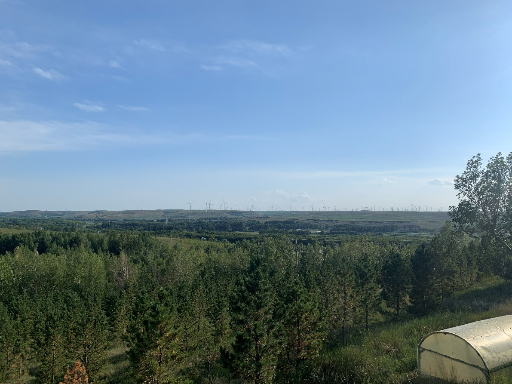

不得不说，太行之险，草原之阔，给我的震撼与回响远多于我去过的云南，广西，贵州的苍翠峻岭，以及朋友圈中张家界，九寨沟，班芙公园令人眼馋的秀水青山。这幽云之地，见证了多少王朝的盛衰起伏？巍巍太行，又曾阻挡了多少意欲劫掠华夏大地的草原铁骑？而此时此刻，苍山不语，只是静静地沐浴着夏日的晨光。它好像一个从战场归田卸甲，坐在村口晒着太阳的老兵，将古战场的风云变幻都藏在心底，只是微笑着享受着难得的和平。从前的边关要地，宋太宗穷兵黩武一辈子都得不到的燕云十六州，如今终归于华夏一统。

第二天，姥姥的精力有所恢复，我们在草原天路景区游玩，大家（包括姥姥）玩的都很尽兴。

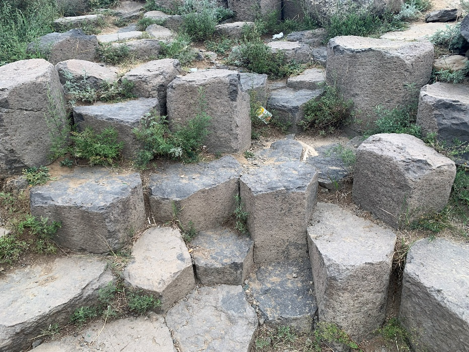

### 回到定县

回程，先是我妈开车。到中午吃饭的时候，我们在一个荒郊野岭的服务区随便买了一点包子吃了之后继续上路。可是不一会儿，我妈就说她困了开不了了，于是我们在下一个服务区换成我开。很快车上陷入一片沉寂------车上除了我之外的人都睡着了。后排的姥姥，大舅小舅自不必说，但是副驾驶的妈妈竟然也沉沉睡去了。一向精力旺盛不服输的她竟然也如此疲惫了。这时车辆正好重新驶入了太行山区，一路高速下坡，全是隧道和急弯，虽然限速降到了 80，我还是感觉速度有些快，转弯有些离心力的感觉。但周围的车都是这个速度，我也没办法再减速了。在最长的隧道中，我发现如果我不踩刹车，还会继续缓缓加速，这坡竟然有这么陡???  于是我不得不集中 150%的精力操作，千万不能在山区出事啊，这一车正在沉沉睡去的家人的性命，可都掌握在我的手里了。一股责任感突然袭来，以前在妈妈手里的接力棒，算是 传到 我手里 了么。就这样，在死一般地沉寂中，我一个人紧张万分地开完了太行山区速降的一个半小时。陪伴我的只有车载音响播放的一首首老歌。行至白石山时，大家陆续醒来，姥姥开始不停地问何时到家，此刻我的心中仅剩释然和慰藉（以及已经麻了 ()）。

晚上，我和妈妈在房间里聊天，聊到姥姥的近况。我实在是没想到 4 年前还能够跟我们神采奕奕地讲述之前日本鬼子的故事的姥姥, 已经变成的这副模样。我越说越激动，我想到，也许很多年以后，我妈也会变成这样，我实在不敢想象这样的场景。但是，我迟早要一个人面对死亡吧。人们不是说 父母 就是 我们面对死亡的最后一道屏障么。但那一天真的来临的时候，又会是怎样呢..  我现在硕士生 还没毕业（当时还没毕业，现在已经毕业了），未来，也是不确定。也不知道 能不能找到一个合适的人一起走过人生的下半程。也许 我真要 孤独地一个人 死去么。想到这里，我积压了太久的情绪在此刻彻底爆发。这四年一个人在国外遇到的烦心事和委屈一下子涌上心头。学业上，生活上，社交上 的 压力 和 种种不顺利，初恋的失败 等等，这些年来我都是一个人默默消化了所有的委屈，还没有放声地哭过。记得 分手那天，也只是一边散步一边任凭泪水静静地从脸庞滑落，仍然在尽力克制强烈的情绪。我本是一个内心十分敏感容易多想的人，只因一个人在外才尽力戴上理性的面具。但我的心 一直是那个 胆小 的小学生吧。但也就是这个胆小的小学生，在 初中 高中 再到大学 没有跟任何人倾诉过，所有难过的时候都是自己一个人度过。现在想起来。父母吵架的时候 经常各自找我倾诉。而我遇到烦恼的时候 又去 找了谁呢。我不想去 打扰朋友。不想在别人面前展露我脆弱的那面。爸爸也只会说男儿有泪不轻弹。我谁也没找。但在这个夜里，我真的忍不了了。在 母亲 面前，我罕见地 放声大哭。我的呼吸是那么急促，以至于我觉得我真的要喘不上来了。一波一波地泪水涌出，但还是意犹未尽。感觉过了 20 分钟之后，一切才再次归于沉寂。我好像记得，妈妈一开始说"没事的没事的""人总会有那一天"，但这些安慰的试图也只是徒劳，后来她说，想哭就哭出来吧。我就哭的更厉害了。

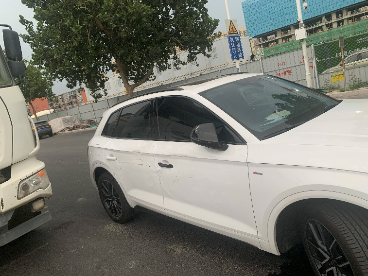

后来，我们又去了保定，西柏坡等地方，按下不表。

## 济南，泉城
回程，依旧是我和我妈轮流开。我们第一天下午到达了济南，去了大明湖游玩。看见景区中 "济南战役国民党守军临时指挥部"时，我再次不厚道地笑了。晚上品尝了大明湖 的 醋鱼 （远大于西湖醋鱼），济南把子肉等美食，酒足饭饱后，我们在泉城的护城河公园走了很久。济南夜间潮湿的空气很好地保留了白天阳光的温暖，让人微微出汗却又不感觉闷热，偶尔小风一吹，还挺凉爽。我们也没有什么目的地，就慢慢地在各个泉之间走。市民广场上的大妈热热闹闹地跳舞，好像还有烟花儿（或者天上的光点？有点记不清了已经）来着。偶尔从公共的饮水处接一瓶泉水一饮而尽，清凉的感觉从喉咙直到胃部，爽啊！这也是我这几年来 我真正放下一切脑中的杂事，放松紧绷的神经的唯一时刻。

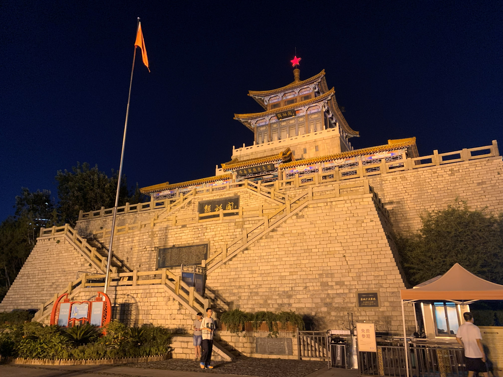 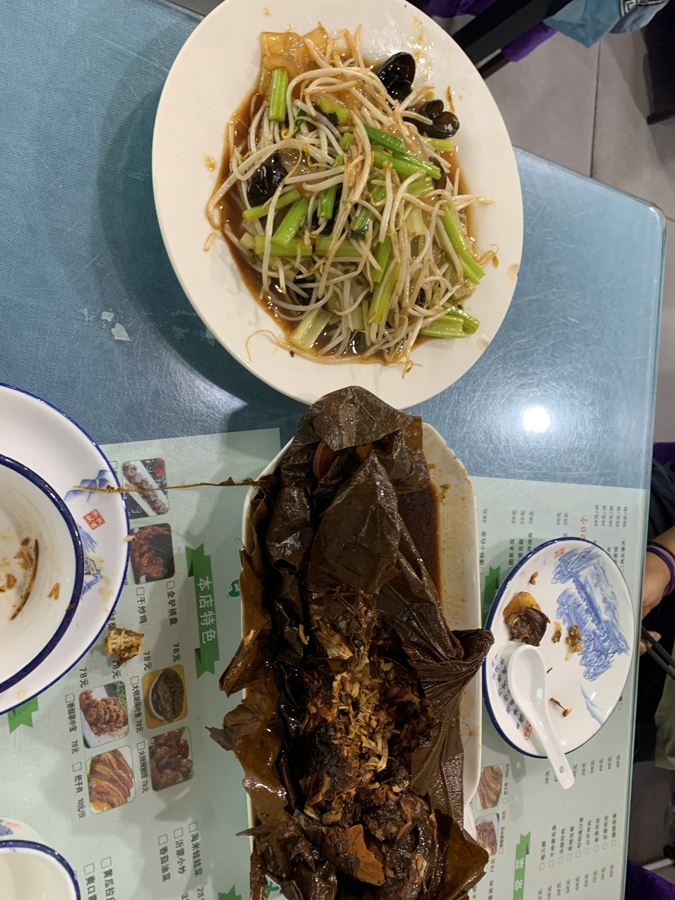

第二天，我们再次启程。在淮南遇到了北上台风的残留云系带来的暴雨。豪雨的重击之下，雨刮器根本没用，眼前花花的一片，就能看见前面车尾灯的红色和双闪的黄色。我们也是降低速度到 40-50，开了半个小时左右才驶出了雨区。当晚，我们终于结束了旅程。 

好了。我想记录的。就到这里了。

