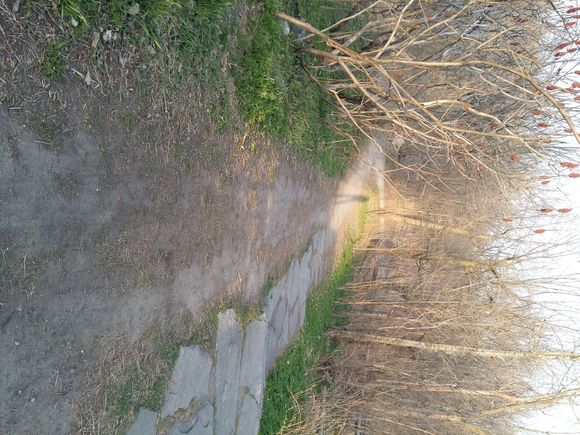

`本文完稿于2020年5月的疫情封闭期间`

蒙特利尔的五月, 乍暖还寒。北美大陆的春天自有他的特点：没有两广的回南天，江南的阴冷和华北的干热，没有西伯利亚和中亚地区那令人汗颜的迅猛升温，也没有笼罩在西欧和中欧那股来自大西洋长驱直入的温暖水汽造就的温凉雾霭。在踏出家门的那一刻，一股凉意钻进了我的衣领。我仿佛看见了几百公里外哈德孙湾那一片渺茫的白色坚冰，仿佛听见北风还在不甘地咆哮。羽绒服，棉裤，我身上这装束，比起几个月前的凛冬时也只少了一条秋裤。

北半球的夏半年，太阳东北升西北落。 在这北纬四十五度，大约六点钟的光景，太阳还高得很。走出几十米，云开雾散，温暖舒展的阳光洒在身上，驱除了寒冷；又一阵阴云掠过，风沙四起时，直教人不禁把脖子缩回领口。高纬度的初春是只有冬与夏的交响曲：夏日热情的烈阳透射进巨大的冰块中，只能不温不火地熔化，温度却总是在冰点徘徊。

爬了一段小坡，到了山前 冰冷的感觉开始慢慢退去。Édouard Montpetit上，几辆自行车“呼啸”而过-------那是绝迹已久的山地自行车党，他们也趁着雪化的时节活动起来。皇家山的树木还没有发芽，但是草地已经冒出新绿，灌木丛中也可以瞥见嫩枝 就连那水泥雕像上附着的爬山虎也不例外——凑近了看，一颗颗淡紫色的叶芽蓄势待发。山上的小动物们也不甘示弱：红色的，黄色的俏（翘）尾鸟儿在无人的校园中肆意飞舞，叽叽喳喳的低语取代了耳边呼呼的风声和魁言魁语；一只我从前没有见过的土拨鼠（？）也从路边的洞穴里探出脑袋晒晒太阳；棕色与黑色的松鼠更不必说，他们从不冬眠。

走到notre dame de neiges墓地旁 引向登山口的大道上，人多了起来；从登山口向上到绿色草坪时，视野内已经有十个以上的魁瓜了。有的是大学生，有的是情侣（夫妇），还有家庭，老人等，他们或是在绿茵上席地而坐，或是在旁边朝向城市远景的长椅上落座，好不热闹。犹记得去冬暴风雪时我和czq一起登山时这里的雪足足可以没过半截大腿，而眼下则是蛰伏了好几个月的青草正在米黄色的斜照下迎风飘动的美妙景色。

算下来这已经是我第四次来这里散步。前几次都是结伴而行，这次则是形影相吊 因此我格外珍惜这独行的机会。虽然耳边不时爆发出阵阵欢笑，而长椅那边的情侣也总是能让我灵敏的听觉捕捉到呢哝细语，不过我干脆承认-----我很孤独。 孤独便一定是坏吗？孤字，仿佛是独自吃瓜看笑的君子；而独，未尝不可解释为独立，独特等。总之，我一直以为，所有人最终是要面对孤独的自己的，早些学会也不是什么坏事。这样想着，我沉默不语，也不去关注旁边的喧闹，只顾沿着曲折的山路前行。contempler。

行至第二层平台，只见一女正对着西去的斜阳出神。四周静静的，只剩下我们两个。我默默在她身后站定，环顾四周：第二层平台的树似乎比去年更高了一些，竟已遮挡住平台广阔的视野，此外别无新奇。只见这名女生向着悬崖的方向迈出一步，索性抱着膝盖坐在平台边缘的斜坡上，让自己的视野被灌木充斥。她歪着头，目光似乎直奔疏影之间的夕阳。 这时已经十九时有余， 四周的光线开始由亮黄转为橙红。 阳光穿过杂乱的树枝照射在她的长发上，竟让人分不清真实的发色----也许她是rousse，也许那通透的颜色只是因为头发被微风打散而被红光渲染。

她是一个人。一个人，和我一样。她似乎并不理会周围的一切，我这样说是因为有一对一直在大声说话的情侣也登上了第二层平台。她竟没有察觉他们的到来……真好。……我莫名地受到了安慰，尽管我告诉自己孤独没有什么大不了，真滑稽啊。我伫立了一会，又默默离开了。自己真是很可怜而很可恨的，因为他总是不能坚持自我不受旁人的影响。

第三层平台没有树木的遮挡， 是观赏落日的绝佳地点。我到达的时候那里已经有许多魁瓜了。我挑了一颗温暖的石头坐下，静静地等待着。平台中间有一个小哥在瑜伽垫上旁若无人地做着拉伸运动；离他不远的地方则有几个人在用英语闲聊；我旁边的石头上的一对好姐妹正在用法语谈天，平台的最前方则是那对情侣。是啊。歪果仁强就强在忘我。他们想做什么就做什么，完全不会在意他人的评价。我似乎做不到……不过细想来这需要自己的思想是完全正确的才行，否则就会走向偏激……可谁又能保证自己思想的正确性呢？……正确的判断需要正确的知识，而这似乎指引着我们走向全才这一艰险的道路。我最近发现，理智不是喊在嘴上的口号这么简单，因理智除非知道每一种行为的真实后果否则不能做出正确的判断。怎么，理智就是把自己当成世界模拟器啦，理智的人仿佛可以成为全知者预知未来，那这样的终极理智简直是变态！同时，什么叫做正确也值得思量啊……正确真真切切地取决于个人的价值观（主观的正确），客观的正确又是什么呢！如果理解了这些就可以变得理智，就可以完全控制住欲望使他为自己的价值观服务了………………咳咳，我本来是写落日，却又扯起这些了，真是。

而落日的美景又岂是我所能描述的呢？眼睛是最好的摄像机，在我旁边架起专业摄像机拍摄的小哥狂按快门的同时，我正在用眼睛记录下这绝美的景色。文学，数学，物理，这不过是描述世界的一种方法罢了，我们的视觉也是如此，摄像机也是如此。对于残阳如血这类描述的对象，用数学物理显得死板，用摄像机显得失真，用文学则是增加了想象的空间，只有用眼睛才是最好的；或者说，将他和周围的一切声音，触觉，心跳，体温，气味等糅合成一段记忆并永存心底才是不二法门。

太阳消失了，只剩下我和摄影小哥。快门还在不停地响着，而我则搓着冻僵的双手离开。夜色渐深，已经晚上二十点三十分了，我还没有吃饭。是时候回到生活中去了。

