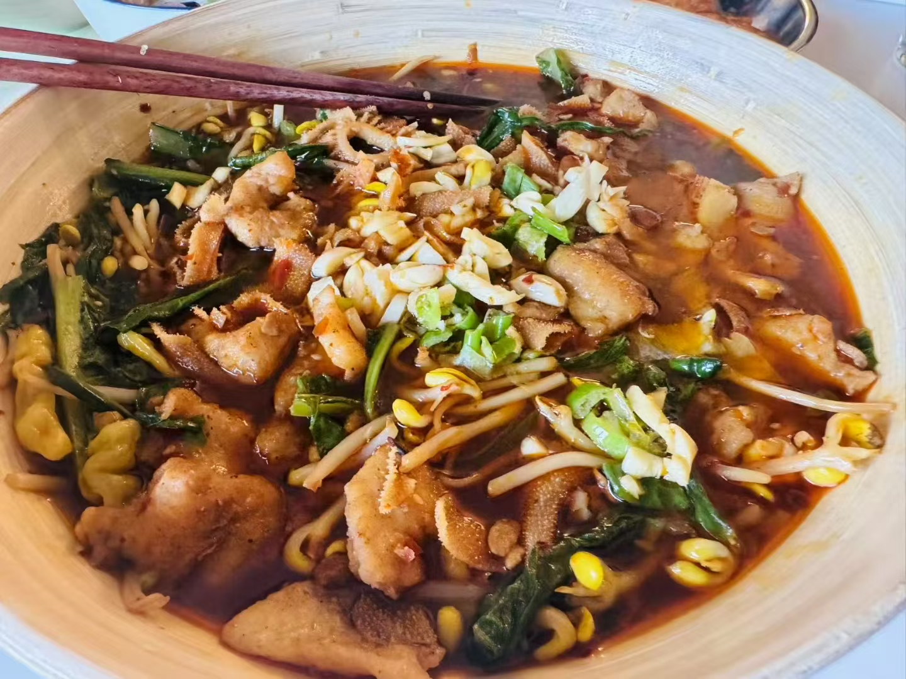

`latest update: 2026.01.30`

最近有一个朋友吃了我做的 海带烧排骨 之后 问我有没有菜谱，我寻思也没有，就给他口述了一个。以下是ChatGPT根据我口述的内容整理出的菜谱。

## 海带烧排骨

###  原料清单

####  主料

* 排骨 适量

####  焯水用

* 葱段、姜片
* 料酒（焯水时用）

####  炒糖色/炒香用

* 食用油
* 白砂糖 2–3 勺（你常用量）
* 葱、姜
* 八角、桂皮（可选再加花椒）

####  调味/炖煮用

* 料酒（炒香后沿锅边淋入）
* 老抽（上色，量少，别炒久）
* 生抽
* 盐
* 胡椒粉（可选）
* 水或清鸡汤（没过排骨）

####  可选配菜

* 胡萝卜 / 土豆 / 海带 / 笋 / 木耳 / 豆腐结 / 豆腐皮（干豆腐）等

---

###  做法步骤（清晰版）

####  1）焯水去腥

1. 排骨**冷水下锅**，放葱姜和一点料酒。
2. 大火煮开后会出浮沫；继续煮 **1–2 分钟**左右。
3. 关火，把水和浮沫倒掉。
4. 排骨用**冷水冲洗**，把附着的浮沫洗干净。
5. 捞出后**尽量沥干/晾干**，或用厨房纸擦干表面水分（后面炒糖色更稳）。

####  2）炒糖色 + 给排骨上色

1. 锅里放油，油热后下白砂糖 **2–3 勺**。
2. 不断搅动，让糖融化并变成**棕褐色**（糖色出来了）。
3. 下擦干的排骨，**不要一次下太多**（最多铺到 1–2 层），中大火翻炒，让排骨均匀裹糖色、炒到略微焦黄，并逼出一点油脂。

####  3）下香料炒香

1. 下葱、姜、八角、桂皮（可加少量花椒）。
2. 继续翻炒一会儿，把香味炒出来（全程基本不加水）。

####  4）沿锅边烹料酒 + 老抽上色

1. **料酒沿锅边分次淋入**（分 2–3 次），听到滋啦汽化后翻炒几下。
2. 加少量**老抽**上色，**别炒太久**，避免糊。

####  5）加汤/水炖煮并调味

1. 立刻加水或清鸡汤，**加到没过排骨**。
2. 开锅后调味：胡椒粉、生抽、盐（盐先别下狠）。
3. **尝汤**：现在尝到“微微咸”就行——后面收汁会更咸更深色。

####  6）小火慢炖

1. 转小火炖到你想要的软烂程度。
2. 中途可以把**葱和姜捞出**（葱易煮烂、姜久煮味道也不太好）。

####  7）收汁出锅

1. 肉炖软后转大火收汁，收到你想要的浓稠度和咸度即可出锅。

##  水煮肉片

###  原料清单

####  A. 底菜（先炒半熟铺碗底）

* 豆芽
* 生菜（或油麦菜等脆叶菜）
* 盐（给底菜用）
* 干辣椒/辣椒段（可选，底菜炒的时候放一点也行）

####  B. 肉片与腌肉

* 任意肉切薄片：猪里脊/梅花、牛肉、鸡胸、鱼片都行（薄片更快熟）
* 料酒
* 生抽（可少量）
* 胡椒粉（可选）
* 盐（可少量或不放，后面底料本身有咸度）
* 五香粉（增香改进点）
* 淀粉（关键：锁水嫩滑）
* 鸡蛋（可放可不放，测试差别不大）

####  C. 汤底/调味

* 牛油火锅底料（超市一小块那种：每次 1 块）
* 水或鸡汤（鸡汤更鲜）
* 郫县豆瓣酱（**必须**，“灵魂”）
* 糖（可选，平衡辣咸）
* 蚝油（可选）
* 生抽（通常可不加或少加：因为豆瓣+火锅底料本身有盐）

####  D. 可加配菜（百搭，想放就放）

* 笋、海带、木耳、豆腐、金针菇等火锅菜

####  E. 泼油与表面香料

* 葱花、蒜末
* 食用油（泼油用）

---

###  做法步骤

####  1）底菜先炒半熟，铺碗底

1. 锅里少许油，下豆芽、生菜（和一些辣椒面或者干辣椒段）。
2. 加**适量盐**（只按这两样菜需要的盐来放）。
3. 大火快炒到**约 50% 熟**（断生但还脆），盛出铺到大碗底部备用。

---

####  2）同一口锅直接做汤底（不用洗锅）

1. 锅里放入**1 块牛油火锅底料**，小火化开。
2. 加水/鸡汤，煮开。
3. 加入**豆瓣酱**（你强调的关键步骤）。
4. 尝味后再决定要不要加糖/蚝油/少量生抽（一般会够咸，不要一上来就猛加）。

---

####  3）肉片腌制（做菜之前就搞定）

1. 肉切薄片。
2. 加料酒、生抽（少量）、胡椒粉/盐（可少或不放）、**五香粉**。
3. 加淀粉抓匀（可加蛋也可不加）。
4. 静置几分钟让它“上浆”。

> 小结论：**淀粉非常重要**，不裹淀粉肉更容易柴、容易出水。

---

####  4）下肉和配菜，煮熟

1. 汤底沸腾后，先下耐煮的配菜（如笋、海带、木耳、豆腐等）。
2. 肉下锅搅散，变色后略煮到熟即可。或者先下肉再下菜，都行，具体问题具体分析
3. 全部熟了以后，把锅里的汤+肉+配菜**整锅浇到**刚才铺好的半熟底菜上。

---

####  5）最后泼油（出香气、仪式感）

1. 表面撒葱花、蒜末
2. 另起小锅或用干净小勺锅把油烧到比较热。
3. 直接浇在葱蒜上，听到“刺啦”一声，蒜香出来就完成。

